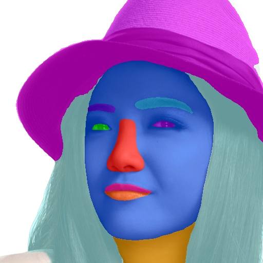
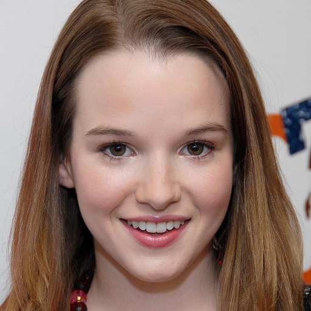
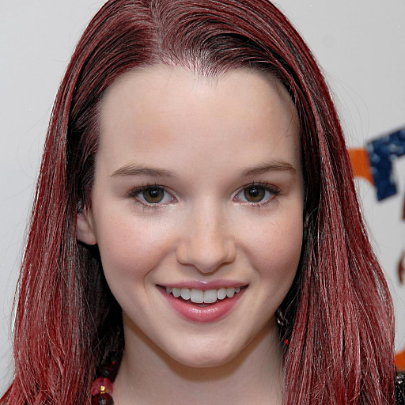
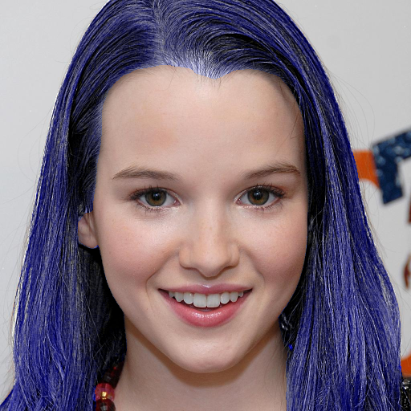
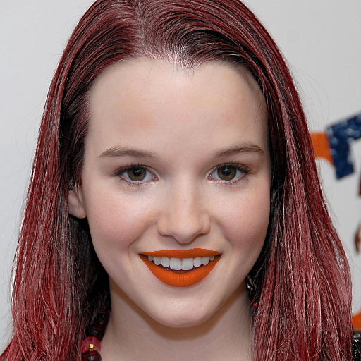

# face-parsing.PyTorch

<p align="center">
    
</p>

### Contents
- [Training](#training)
- [Demo](#Demo)
- [References](#references)

## Training

1. Prepare training data:

-- download [CelebAMask-HQ dataset](https://github.com/switchablenorms/CelebAMask-HQ)

-- extract to ~/data
    
-- make backups

```Shell
cp -a CelebAMask-HQ-mask-anno{,_orig}
cp -a CelebA-HQ-img{,_orig}
```

--  change file path in the `prepropess_data.py`, adjust classes and run

```Shell
python prepropess_data.py
```

-- Remove images with eye glasses and combined masks
```Shell
find CelebAMask-HQ-mask-anno_orig/ -type f -name \*eye_g.png -exec basename -s _eye_g.png {} \; | awk '{print $1 + 0}' > /var/tmp/eye_g.txt

for f in $(cat /var/tmp/eye_g.txt); do echo $f; rm CelebA-HQ-img/$f.jpg; done

for f in $(cat /var/tmp/eye_g.txt); do echo $f; rm mask/$f.png; done
```

-- Remove mask items with eye glasses 
```Shell
find CelebAMask-HQ-mask-anno_orig/ -type f -name \*eye_g.png -exec basename -s _eye_g.png {} \; > /var/tmp/eye_g.txt

for f in $(cat /var/tmp/eye_g.txt); do echo $f; find CelebAMask-HQ-mask-anno -type f -name $f\* -delete; done
```

-- Evaluation dataset
```Shell
andrei@fedor:~/data/CelebAMask-HQ$ find CelebA-HQ-img -type f -name \*64\*|wc -l
853

find CelebA-HQ-img -type f -name \*64\* -exec mv {} CelebA-HQ-eval-img/ \;
```

-- Verify counters
```Shell
andrei@fedor:~/data/CelebAMask-HQ$ wc -l /var/tmp/eye_g.txt ; ls CelebA-HQ-eval-img | wc -l; ls CelebA-HQ-img | wc -l; ls mask | wc -l
1549 /var/tmp/eye_g.txt
853
27598
28451
```

2. Train the model using CelebAMask-HQ dataset:
Just run the train script: 
```
    $ CUDA_VISIBLE_DEVICES=0,1 python -m torch.distributed.launch --nproc_per_node=2 train.py
```

If you do not wish to train the model, you can download [our pre-trained model](https://drive.google.com/open?id=154JgKpzCPW82qINcVieuPH3fZ2e0P812) and save it in `res/cp`.

3. Validation
Metrics for the original model:
````
Loading model res/79999_iter_orig.pth
Processing 853 images in 54 batches with 4 threads...
100%|███████████████████| 54/54 [01:50<00:00,  2.05s/it]

Class-wise Metrics:
Class   Name            IoU     Prec    Recall  Count
0       background      0.913   0.951   0.957   853
1       skin            0.931   0.960   0.969   853
2       l_brow          0.671   0.809   0.748   823
3       r_brow          0.645   0.798   0.708   824
4       l_eye           0.716   0.820   0.791   836
5       r_eye           0.704   0.817   0.766   841
7       l_ear           0.666   0.791   0.746   442
8       r_ear           0.644   0.776   0.718   394
10      nose            0.882   0.929   0.948   853
11      mouth           0.787   0.888   0.863   519
12      u_lip           0.783   0.897   0.863   851
13      l_lip           0.824   0.911   0.897   851
14      neck            0.831   0.903   0.911   834
17      hair            0.899   0.950   0.939   832

Mean IoU: 0.7782
Mean Precision: 0.8714
Mean Recall: 0.8445
````
Metrics for weighted-class model trained on 3090 with batch size 64:
````
Loading model res/cp_64/99999_iter.pth
Processing 897 images in 57 batches with 4 threads...

Class-wise Metrics:
Class   Name            IoU     Prec    Recall  Count
0       background      0.926   0.963   0.958   897
1       skin            0.934   0.962   0.970   897
2       l_brow          0.720   0.845   0.798   866
3       r_brow          0.720   0.857   0.796   863
4       l_eye           0.778   0.874   0.851   850
5       r_eye           0.781   0.878   0.853   853
7       l_ear           0.695   0.829   0.763   460
8       r_ear           0.692   0.818   0.765   437
10      nose            0.887   0.941   0.941   897
11      mouth           0.769   0.886   0.835   529
12      u_lip           0.791   0.885   0.882   894
13      l_lip           0.830   0.907   0.907   894
14      neck            0.860   0.923   0.926   869
17      hair            0.910   0.956   0.949   880

Mean IoU: 0.8067
Mean Precision: 0.8945
Mean Recall: 0.8710
````
Metrics for weighted-class model trained on 4060 with batch size 64:
````
Loading model res/cp/99999_iter.pth
Processing 853 images in 54 batches with 4 threads...

Class-wise Metrics:
Class   Name            IoU     Prec    Recall  Count
0       background      0.975   0.988   0.988   853
1       skin            0.912   0.962   0.947   853
2       l_brow          0.639   0.697   0.767   825
3       r_brow          0.628   0.687   0.765   824
4       l_eye           0.667   0.696   0.811   836
5       r_eye           0.658   0.692   0.792   841
6       nose            0.865   0.886   0.974   853
7       mouth           0.806   0.893   0.880   519
8       u_lip           0.789   0.835   0.936   851
9       l_lip           0.816   0.863   0.938   851

Mean IoU: 0.7756
Mean Precision: 0.8198
Mean Recall: 0.8799
````

## Demo
1. Evaluate the trained model using:
```Shell
# evaluate using GPU
python test.py
```

## Face makeup using parsing maps
[**face-makeup.PyTorch**](https://github.com/zllrunning/face-makeup.PyTorch)
<table>

<tr>
<th>&nbsp;</th>
<th>Hair</th>
<th>Lip</th>
</tr>

<!-- Line 1: Original Input -->
<tr>
<td><em>Original Input</em></td>
<td></td>
<td></td>
</tr>

<!-- Line 3: Color -->
<tr>
<td>Color</td>
<td></td>
<td></td>
</tr>

</table>


## References
- [BiSeNet](https://github.com/CoinCheung/BiSeNet)